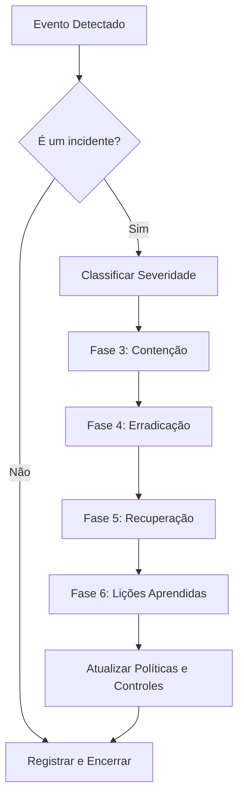

# Plano de Resposta a Incidentes (PRI)

- **ID do Documento:** PRI-2025-001
- **Versão:** 1.1
- **Responsável:** Ingrid Soares

---

## 1. Objetivo

Este documento estabelece o processo formal para responder a incidentes de segurança da informação, garantindo uma reação rápida, coordenada e eficaz para minimizar o impacto adverso nos negócios.

---

## 2. Funções e Responsabilidades (Equipe CSIRT)

A resposta a incidentes é gerenciada pela Equipe de Resposta a Incidentes de Segurança da Computação (CSIRT).

| Função | Responsabilidades Chave |
| :--- | :--- |
| **Líder de Resposta (Incident Lead)** | Coordenação geral, ponto de contato principal, reporta à gestão. |
| **Analista de Segurança** | Análise técnica, forense, identificação de IOCs, contenção e erradicação. |
| **Especialista em Redes** | Isolação de rede, bloqueio de IPs, análise de tráfego. |
| **Assessor Jurídico/Legal** | Avalia implicações legais, regulatórias (LGPD) e de conformidade. |
| **Comunicação Corporativa** | Gerencia a comunicação interna e externa (se necessário). |

---

## 3. Classificação de Severidade de Incidentes

Os incidentes são classificados para determinar a urgência e o escopo da resposta.

| Nível | Descrição | Exemplos | Ação Imediata |
| :--- | :--- | :--- | :--- |
| **4 (Crítico)** | Impacto severo nos negócios, perda de dados sensíveis, interrupção de serviços essenciais. | Ransomware em servidores de produção, vazamento de dados de clientes. | Acionamento imediato de toda a equipe CSIRT, 24/7. |
| **3 (Alto)** | Impacto significativo, sistemas importantes afetados, risco de perda de dados. | Infecção por malware em um departamento, site institucional offline. | Acionamento da equipe técnica CSIRT em horário comercial. |
| **2 (Médio)** | Impacto limitado, afeta um pequeno número de usuários, sem perda de dados sensíveis. | Tentativa de phishing bem-sucedida em um único usuário. | Investigação padrão pela equipe de segurança. |
| **1 (Baixo)** | Evento de segurança sem impacto direto ou com impacto mínimo. | Varredura de portas bloqueada pelo firewall, alerta de vírus em quarentena. | Monitoramento e registro para análise de tendências. |

---

## 4. Fluxograma do Processo de Resposta

---

## 5. Fases da Resposta a Incidentes (Detalhado)

O processo de resposta a incidentes segue o modelo de 6 fases do SANS/NIST.

### Fase 1: Preparação
- **Objetivo:** Garantir que a organização esteja pronta para responder a incidentes.
- **Ações:**
  - Treinamento regular da equipe CSIRT.
  - Manutenção de ferramentas de análise (ex: SIEM, EDR) e resposta.
  - Definição de canais de comunicação seguros (ex: chat criptografado).

### Fase 2: Identificação
- **Objetivo:** Determinar se um evento é, de fato, um incidente de segurança.
- **Ações:**
  - Análise de logs de sistemas, firewalls e IDS/IPS.
  - Correlacionar alertas de múltiplas fontes para confirmar a ameaça.
  - Documentar o evento inicial (IOCs, data, hora, sistemas afetados) e classificar a severidade.

### Fase 3: Contenção
- **Objetivo:** Limitar o dano e impedir que o incidente se espalhe.
- **Ações:**
  - **Curto prazo:** Isolar segmentos de rede afetados, desativar contas de usuário comprometidas.
  - **Longo prazo:** Fazer backup dos sistemas afetados para análise forense.
  - Bloquear endereços IP maliciosos no firewall.

### Fase 4: Erradicação
- **Objetivo:** Remover a causa raiz do incidente do ambiente.
- **Ações:**
  - Reinstalar sistemas a partir de uma imagem limpa e confiável.
  - Aplicar patches de segurança para a vulnerabilidade explorada.
  - Resetar senhas de todas as contas comprometidas e relacionadas.

### Fase 5: Recuperação
- **Objetivo:** Restaurar os sistemas para a operação normal de forma segura.
- **Ações:**
  - Restaurar dados a partir de backups limpos e validados.
  - Monitorar os sistemas de perto por um período determinado para garantir que o atacante não retorne.
  - Validar que os sistemas estão funcionando conforme o esperado com os donos do negócio.

### Fase 6: Lições Aprendidas (Pós-Incidente)
- **Objetivo:** Analisar o incidente e a resposta para melhorar a postura de segurança.
- **Ações:**
  - Realizar uma reunião pós-incidente (geralmente 1-2 semanas depois) com todas as partes envolvidas.
  - Documentar o que funcionou, o que não funcionou e por quê.
  - Criar um plano de ação para implementar melhorias nos processos e controles de segurança.

---

## 6. Plano de Comunicação

| Nível de Severidade | A quem notificar (Interno) | A quem notificar (Externo) |
| :--- | :--- | :--- |
| **4 (Crítico)** | Gestão Executiva (C-Level), Jurídico, CSIRT completo. | ANPD (se houver vazamento de dados), clientes afetados, imprensa (via Comunicação Corp.). |
| **3 (Alto)** | Gestores da área de negócio afetada, Líder de TI. | Fornecedores de tecnologia relevantes. |
| **2 (Médio)** | Help Desk, gestor do usuário afetado. | N/A |
| **1 (Baixo)** | Apenas registro interno da equipe de segurança. | N/A |
