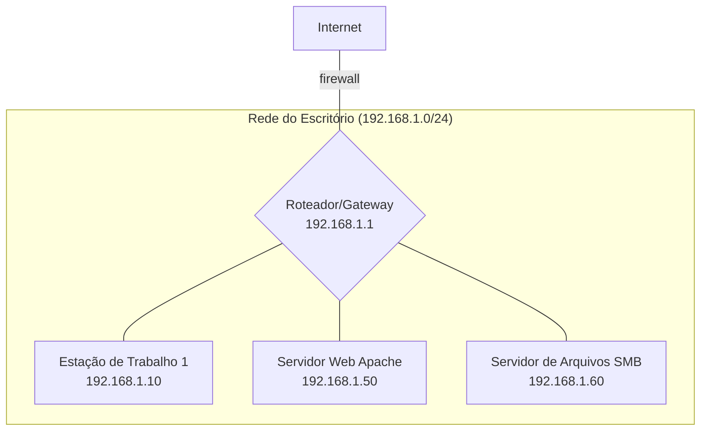

# Relatório de Mapeamento
## Mapeamento de Rede em Ambiente Docker

**Módulo:** Fundamentos de Cybersegurança  
**Data:** 15 de janeiro de 2026  
**Autora:** Ingrid Soares  

---

## 1. Capa

- **Título do Projeto:** Projeto Técnico - Mapeamento de Rede em Docker
- **ID do Relatório:** RT-2025-001
- **Data de Emissão:** 2025-07-29
- **Analista Responsável:** Ingrid Soares
- **Versão:** 1.0

---

## 2. Sumário Executivo

Este relatório detalha os resultados de um exercício de mapeamento de rede e análise de vulnerabilidades realizado no ambiente de escritório simulado. Foram identificados 3 ativos principais, incluindo um servidor web com uma vulnerabilidade crítica (Apache desatualizado) e um servidor de arquivos com permissões de compartilhamento excessivamente abertas. Recomenda-se a aplicação imediata de patches de segurança no servidor web e a revisão das permissões no servidor de arquivos para mitigar os riscos de acesso não autorizado e exploração.

---

## 3. Objetivo

O objetivo deste trabalho foi identificar e documentar todos os ativos presentes na sub-rede `192.168.1.0/24`, avaliar sua exposição a potenciais ameaças e fornecer um plano de ação para corrigir as vulnerabilidades encontradas.

---

## 4. Escopo

O escopo deste teste limitou-se à sub-rede `192.168.1.0/24`, conforme definido no desafio. As atividades incluíram varredura de portas, identificação de serviços e análise de configurações.

---

## 5. Metodologia

Para a execução do mapeamento, foram utilizadas as seguintes ferramentas e técnicas:
- **Nmap:** Para varredura de portas TCP/UDP, identificação de serviços e versões.
- **Análise Manual:** Inspeção das configurações de compartilhamento de rede (SMB).
- **OSINT (Simulado):** Coleta de informações sobre versões de software para identificar vulnerabilidades conhecidas (CVEs).

---

## 6. Diagrama da Rede

*Obs: Diagrama simplificado para fins de clareza.*

---

## 7. Diagnóstico de Exposição

A análise revelou os seguintes pontos de exposição:

| Ativo | IP | Serviço Exposto | Vulnerabilidade | Risco |
| :--- | :--- | :--- | :--- | :--- |
| Servidor Web | 192.168.1.50 | HTTP (Porta 80) | Apache 2.4.29 (vulnerável a CVE-2021-41773) | **Crítico** |
| Servidor de Arquivos | 192.168.1.60 | SMB (Porta 445) | Compartilhamento "Publico" com permissão de escrita para "Todos" | **Alto** |
| Estação de Trabalho | 192.168.1.10 | RDP (Porta 3389) | Acesso remoto habilitado | Médio |

---

## 8. Recomendações

1.  **Atualização do Servidor Web:** Atualizar imediatamente o Apache para a versão mais recente para corrigir a vulnerabilidade crítica.
2.  **Revisão de Permissões:** Alterar as permissões do compartilhamento "Publico" no servidor de arquivos para "Somente Leitura" para o grupo "Todos". Acesso de escrita deve ser restrito a grupos de usuários autorizados.
3.  **Segmentação de Rede:** Isolar o Servidor Web em uma sub-rede separada (DMZ) para limitar o impacto de uma possível comprometimento.

---

## 9. Plano de Ação (Modelo 80/20)

| Ação (20% do Esforço) | Impacto (80% do Resultado) | Responsável | Prazo |
| :--- | :--- | :--- | :--- |
| **1. Aplicar patch no Apache** | Mitiga o risco de execução remota de código, a vulnerabilidade mais crítica. | Equipe de Servidores | 24 Horas |
| **2. Corrigir permissões do SMB** | Previne a modificação ou exclusão de arquivos por usuários não autorizados. | Equipe de Infraestrutura | 48 Horas |

---

## 10. Conclusão

O ambiente apresenta riscos significativos que podem ser mitigados com ações de baixo esforço e alto impacto. A implementação do plano de ação proposto é crucial para garantir a segurança e a integridade dos dados da organização.

---

## 11. Anexos

Nenhum anexo para este relatório.
